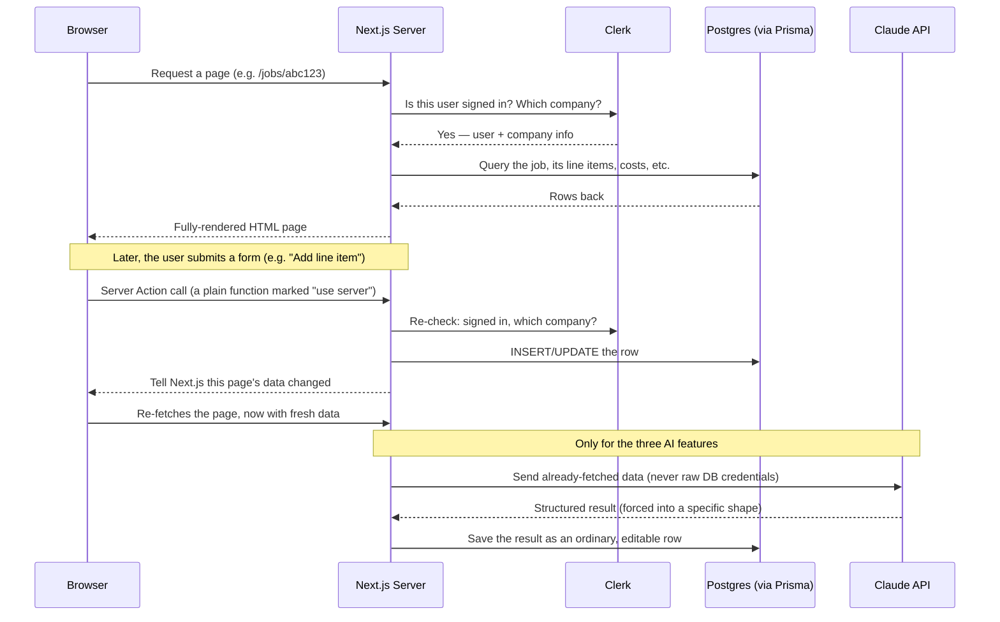

# Onboarding — welcome, Cyrus

This doc is written for you specifically. You're going to write real code
here, but you haven't spent years as a professional engineer, so this
explains the *why* behind every choice, not just the *what*. Read it once,
then keep it open for the first few weeks — it's meant to be a reference,
not a one-time read.

Start here, then go to `WORK-SPLIT.md` for your first task.

## 1. What we're building

Prova is an operating system for a specialty-trade construction
subcontractor — specifically the kind of company that self-performs metal
framing/drywall, lath & plaster, EIFS (exterior insulation finish
systems), acoustical ceilings, and fireproofing work as a subcontractor
*to* general contractors, often under union agreements. Today, in its
current state, it handles: creating an estimate for a job (with AI help
turning a plain-language scope of work into line items), turning that
estimate into a signed contract, tracking job costs against the budget as
work happens (the "WIP" — work in progress — percent-complete math a
surety or CPA expects to see), managing the paperwork a job generates
(certificates of insurance, lien waivers, certified payroll, the actual
subcontract agreement file and its amendments), tracking relationships
with the general contractors who hire us (their standing payment terms,
bids we've submitted to them, how reliably they've paid us before), and a
small reusable line-item catalog + bid history so pricing gets easier
over time. It is *not* yet a full replacement for QuickBooks, a payroll
system, or a project-management tool like Procore — those are either
partially connected (QuickBooks) or not started (see section 7).

## 2. The stack, and why each piece

- **Next.js (App Router)** — a React framework that runs on both the
  server and the browser. We use it instead of a separate frontend +
  backend API because it lets one file be both "the page" and "the code
  that talks to the database" (see the data-flow section below). Fewer
  moving parts for a two-person team.
- **TypeScript** — JavaScript with types. Catches a whole class of bugs
  (passing the wrong shape of data around) before the code ever runs.
- **Turborepo + pnpm workspaces** — this is a "monorepo": multiple
  packages (`apps/web`, `packages/db`, `packages/integrations`,
  `packages/ui`) that live in one repo and can import each other directly.
  pnpm is the package manager (like npm, but faster and stricter about
  not letting packages accidentally use dependencies they didn't declare).
  Turborepo coordinates running commands (build, lint) across all the
  packages at once.
- **Prisma** — an ORM (object-relational mapper): you describe your
  database tables in one file (`packages/db/prisma/schema.prisma`) and it
  generates a fully-typed client to query them, plus generates the SQL
  migration files when you change the schema. Chosen over writing raw SQL
  because with two people editing the data model, typos in column names
  become a compile error instead of a 2am bug.
- **PostgreSQL, hosted on Neon** — the actual database. Postgres because
  the data is deeply relational (a Job belongs to a Company, has many
  LineItems, which have many CostEntries, etc.) — a NoSQL database would
  make that harder, not easier. Neon specifically because it's
  serverless-friendly (scales to zero, works well with Vercel) and
  supports branching a database for dev/test.
- **Clerk** — handles user sign-up, login, sessions, and password resets
  for us. We didn't build our own auth because that's a lot of
  security-sensitive code to get right, and Clerk is a specialized vendor
  for exactly this.
- **Vercel** — where the app is deployed. It's built by the same company
  that makes Next.js, so deploys are a git push away, and it also hosts
  our file storage (see Vercel Blob below).
- **Vercel Blob** — file storage for anything a user uploads (compliance
  documents, subcontract agreement PDFs). Chosen because it's already
  part of the Vercel account with a two-line integration, versus setting
  up a separate S3 bucket.
- **Tailwind CSS** — utility-class styling (`className="px-4 py-2
  bg-slate-800"` instead of writing separate CSS files). Faster to work
  with when there's no dedicated designer building a component library
  from scratch.
- **Anthropic API (Claude)** — powers the three AI features: turning a
  job's WIP numbers into a plain-language summary, reading an uploaded
  compliance document (a COI, lien waiver, etc.) into structured fields,
  and turning pasted scope-of-work text into draft estimate line items.

## 3. The mental model — what happens when someone uses the app

There is no separate backend API server. Next.js **is** both.



The important habit to build: a **page file** (`page.tsx`) is a server
component that *reads* data and renders HTML. A **Server Action** (a
function in `lib/actions.ts`, always starting with the string
`"use server"` at the top of the file) is what *writes* data. Forms call
Server Actions directly — there's no `fetch("/api/...")` anywhere in this
app for normal database writes. That's the single biggest structural
difference from a typical React + Express app, and it's why there's no
`api/` folder full of route handlers (the two exceptions,
`app/api/quickbooks/*`, exist only because QuickBooks' OAuth flow
requires an actual HTTP redirect target, which Server Actions can't be).

## 4. File tree, annotated

```
prova/
├── ARCHITECTURE.md          ← READ THIS TOO. Explains *why* the data
│                              model is shaped the way it is, in far more
│                              depth than this file goes into.
├── apps/
│   └── web/                 ← the actual Next.js application
│       ├── app/
│       │   ├── (app)/       ← every page behind login (dashboard, jobs,
│       │   │                  contacts, compliance, catalog, bids,
│       │   │                  settings, team, schedule). The
│       │   │                  parenthesized folder name is a Next.js
│       │   │                  convention meaning "group these routes,
│       │   │                  don't add /app/ to their URL."
│       │   │   └── jobs/[id]/page.tsx  ← the single biggest, most
│       │   │       central page in the app. A job's estimate, contract,
│       │   │       costing, and paperwork all live on this one page.
│       │   ├── sign-in/, sign-up/      ← Clerk's hosted auth screens
│       │   ├── esign/[token]/          ← public, no-login page a client
│       │   │   signs a contract on (the link is the "password")
│       │   ├── portal/[token]/         ← same idea, a client's read-only
│       │   │   view of their own jobs
│       │   └── api/quickbooks/         ← the two Route Handlers that
│       │       exist only because OAuth needs a real HTTP endpoint
│       ├── lib/
│       │   ├── actions.ts   ← EVERY database write in the whole app.
│       │   │                  One large file (1,500+ lines and growing)
│       │   │                  — see Conventions below for how to add to
│       │   │                  it without stepping on someone else's work.
│       │   ├── auth.ts      ← requireCompanyContext(), the one function
│       │   │                  every page and action calls first. It
│       │   │                  checks the Clerk session and loads (or, on
│       │   │                  someone's very first sign-in, creates)
│       │   │                  their Company + User row.
│       │   ├── wip.ts       ← pure math, no database calls: the
│       │   │                  percent-complete / over-under-billing
│       │   │                  formulas. Kept separate from actions.ts on
│       │   │                  purpose so financial math is easy to
│       │   │                  read and verify in isolation.
│       │   └── gc-reliability.ts  ← same idea, pure math, for a GC's
│       │       payment-reliability numbers.
│       ├── components/      ← shared React pieces. Mostly small
│       │   │                  client-side forms (anything that needs a
│       │   │                  "submitting..." spinner).
│       └── middleware.ts    ← the list of which URL paths require a
│                              signed-in session. Forget to add a new
│                              route here and it's technically
│                              unprotected (Clerk still blocks it via
│                              requireCompanyContext, but always add it
│                              here too — see Conventions).
├── packages/
│   ├── db/
│   │   └── prisma/
│   │       ├── schema.prisma        ← THE data model. Every table, every
│   │       │                          column, in one file.
│   │       └── migrations/          ← auto-generated SQL, one folder per
│   │           schema change. Never hand-edit an old one.
│   ├── integrations/
│   │   └── src/
│   │       ├── anthropic.ts  ← every Claude API call lives here
│   │       └── quickbooks.ts ← the QuickBooks OAuth connection code
│   └── ui/                   ← a handful of shared components (Button,
│                                Card, StatusBadge) used across pages
├── turbo.json                 ← tells Turborepo which env vars matter
│                                 for caching build results correctly
└── pnpm-workspace.yaml         ← declares the monorepo's packages
```

## 5. Run it locally, from zero

1. **Install Node.js 20+.** Check with `node -v`. If you don't have it,
   easiest on a Mac is `brew install node@20` (install Homebrew first
   from https://brew.sh if you don't have it).
2. **Install pnpm.** Run `npm install -g pnpm@10.33.0`. Verify with
   `pnpm -v`.
3. **Clone the repo** (see the message Diego sends you for the exact
   command) and `cd` into it.
4. **Install dependencies:** `pnpm install` from the repo root. This
   installs everything for every package in the monorepo at once.
5. **Get your env vars from Diego.** He'll send you, over a secure
   channel (not email, not committed to the repo — see his message):
   - A `DATABASE_URL` (a Postgres connection string) and a
     `DIRECT_URL` (the SAME database, unpooled — migrations need it).

     Use YOUR OWN Neon project here, not production. There are two, one
     per developer, and which one your `.env` names decides whether a
     mistake costs you an afternoon or costs the business its data. Both
     values must come from the same project: `DIRECT_URL` is that
     project's direct endpoint, `DATABASE_URL` its `-pooler` one. If they
     disagree the tooling now refuses to run, which is the check that
     exists because they once silently didn't match for weeks.
   - `NEXT_PUBLIC_CLERK_PUBLISHABLE_KEY` and `CLERK_SECRET_KEY`
   - `ANTHROPIC_API_KEY`
   - `BLOB_READ_WRITE_TOKEN`
   Copy the example files first: `cp packages/db/.env.example
   packages/db/.env` and `cp apps/web/.env.example apps/web/.env`, then
   fill in the real values in both `.env` files (yes, `DATABASE_URL` goes
   in both — Prisma CLI commands run from `packages/db`, Next.js reads
   its own `.env` from `apps/web`). `DIRECT_URL` only goes in
   `packages/db/.env`; nothing but the Prisma CLI reads it.
6. **Run migrations:** from the repo root, `pnpm db:migrate`. This
   creates every table in your database.

   Your database is a dev database and is SUPPOSED to fall behind `main`
   — nothing applies migrations to it automatically. When a page 500s
   locally with "column does not exist", that means your database is
   behind, not that the code is broken. Catch it up with
   `pnpm --filter @prova/db run migrate:deploy`, which prints the host it
   is talking to before it changes anything.
7. **Start the dev server:** `pnpm dev` from the repo root.
8. **Open http://localhost:3000.** Click "Sign up," create an account —
   this automatically creates your own `Company` on first sign-in. You
   should land on `/dashboard`. Create a job from there to confirm
   everything (database, auth) is wired up correctly.

If any step fails, the error message almost always says which env var is
missing or which command wasn't found — read it before asking, but don't
hesitate to ask either.

## 6. Conventions

- **Naming:** database tables and TypeScript types are `PascalCase`
  (`JobLineItem`), fields and variables are `camelCase`
  (`unitPrice`), enum values are `SCREAMING_SNAKE_CASE`
  (`ESTIMATE`).
- **New pages** go in `apps/web/app/(app)/<name>/page.tsx`. Copy the
  structure of an existing simple page (`app/(app)/catalog/page.tsx` is a
  good template — list + create form) rather than starting from a blank
  file.
- **New database writes** are new exported `async function`s at the
  **end** of `lib/actions.ts`. Every single one starts by calling
  `requireCompanyContext()` and then checking that whatever row you're
  about to touch actually belongs to `company.id` — this is the entire
  security boundary that keeps one company's data invisible to another.
  Never skip it, even for "obviously fine" cases.
- **New protected routes:** add the path to the list in
  `apps/web/middleware.ts` (matches the pattern of the routes already
  there).
- **New tables:** add the model to `packages/db/prisma/schema.prisma`,
  then run `pnpm --filter @prova/db exec prisma migrate dev --name
  a_short_description` to generate the migration. Commit the whole
  generated `migrations/<timestamp>_.../migration.sql` folder — never
  hand-edit it afterward.
- **Styling:** copy the `className` patterns from a nearby element rather
  than inventing new ones — the whole app leans on a small, repeated set
  of Tailwind classes (dark slate backgrounds, blue accent buttons) for
  visual consistency.
- **Before every commit:** run `pnpm typecheck` and `pnpm lint` from the
  repo root. Both must pass clean.
- **Tests:** there isn't a test suite yet (see section 7) — this is a
  known gap, not something you missed.
- **Commit messages:** `type(scope): short summary`, e.g. `feat(web): add
  vendor directory page` or `fix(web): correct retainage rounding`. A
  longer explanation goes in the body if the "why" isn't obvious from the
  summary alone.

## 7. What's actually done vs. half-done vs. not started

**Solidly built:** company profile + multi-state licensing, trade-scope
tagging, union affiliation records, insurance/bonding records,
multi-location support, the estimate → contract → job-costing flow (one
set of line items *is* the estimate, the budget, and the contract — see
`ARCHITECTURE.md` for why), compliance document tracking with AI
extraction, GC relationship management (create/delete a contact directly,
prospect/active/inactive status, account type, MSA and prequalification
tracking, standing terms, bid tracking, payment reliability), a reusable
line-item catalog, labor-hour estimates
by craft, estimate versioning, bid history, and the actual subcontract
agreement file storage with amendment versioning.

**Half-done / connected but shallow:**
- **QuickBooks** — the OAuth connection works (you can link an account),
  but nothing actually syncs data yet. It's a connection, not an
  integration.
- **E-signature** — covers signing the *initial* contract only. Change
  orders and lien waivers aren't e-signable yet.
- **Multi-jurisdiction license data** — only CA/AZ/UT classification
  codes are seeded; Nevada was deliberately left empty rather than guess
  at incomplete public data.

**Not started at all:** real payment processing (a "Payment" today is
just a manual record, not a card/ACH charge), retainage tracking,
certified payroll report generation, prevailing-wage rules, labor time
tracking (field hours by employee/craft), safety/incident logging,
submittals/RFIs/drawing storage, equipment and vendor/material
management, punch lists and warranty tracking, a notifications/alerts
system of any kind (nothing proactively tells anyone a COI is about to
expire — it only shows up if someone happens to look at the page), and
any user role beyond "Owner" or "Member" (no separate estimator/PM/
foreman/accounting permission levels yet).

**Known shortcuts, said plainly so you don't find them cold:** there is
no automated test suite anywhere — correctness is currently verified by
hand (typecheck, lint, and manually clicking through the app) before
every deploy. QuickBooks tokens are stored as plain database columns, not
encrypted — fine for a sandbox connection, not fine before a real
customer's QuickBooks account touches it. And until today, the two git
branches were named after Claude session IDs instead of `main` — that's
fixed now, but you may see the old names in commit history.

## 8. The 5 things most likely to confuse you

1. **"Estimate," "contract," "budget," and "job costing" are the same
   rows, not four different features.** A `JobLineItem` is
   simultaneously all four — there's no "convert estimate to contract"
   button that copies data anywhere, because there's nothing to copy.
   This looks unusual coming from a typical CRM/PM tool and it's on
   purpose (`ARCHITECTURE.md` explains the reasoning in depth — read it
   before you build anything that touches line items).
2. **Server Actions, not an API.** If you're used to a REST or GraphQL
   API with request/response shapes, this codebase won't have one for
   normal writes. A form's `action={someFunction}` prop calling straight
   into `lib/actions.ts` *is* the API layer.
3. **Money is always a `Decimal`, never a plain JS number.** Pass amounts
   to Prisma as strings (`"1234.56"`), not floating-point numbers —
   floats introduce rounding errors that are unacceptable in financial
   data. Look at any existing action for the pattern.
4. **AI results are never trusted silently.** Every row a Claude call
   helps create gets an `aiExtracted` or `aiDrafted` boolean flag and
   shows a "please verify" badge in the UI — and stays fully editable
   like any manually-entered row. If you build a new AI feature, follow
   this same pattern rather than auto-committing what the model returns.
5. **Every action re-checks company ownership, even when it looks
   redundant.** You'll see the same few lines (load the row, confirm
   `row.companyId === company.id`, else throw) repeated in nearly every
   function in `actions.ts`. That repetition *is* the multi-tenant
   security model — don't refactor it away to be "DRY," and don't skip
   it when adding a new action.

Welcome aboard. Next: `WORK-SPLIT.md`.
